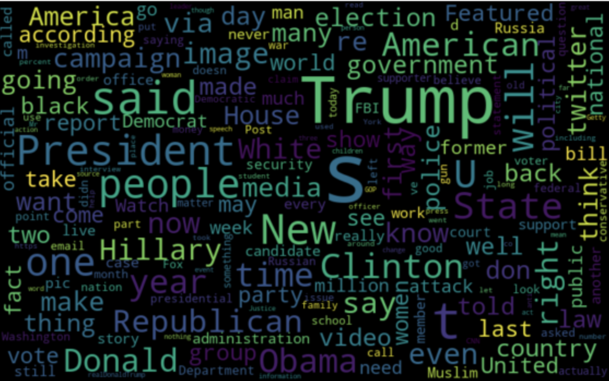
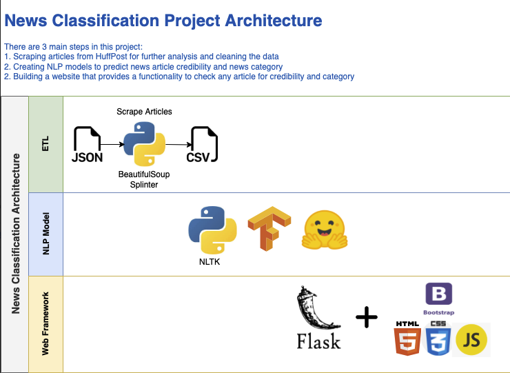
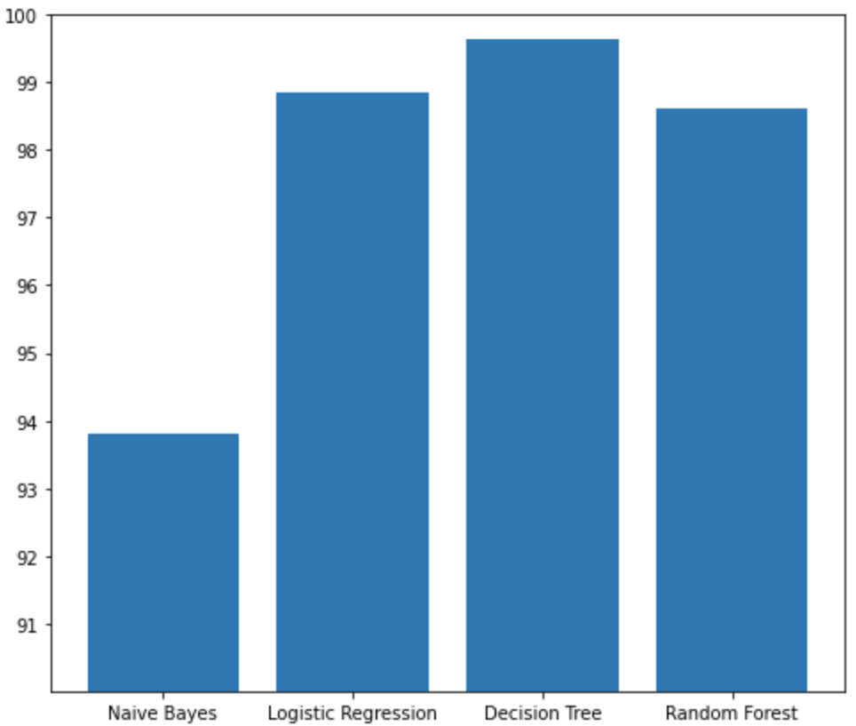
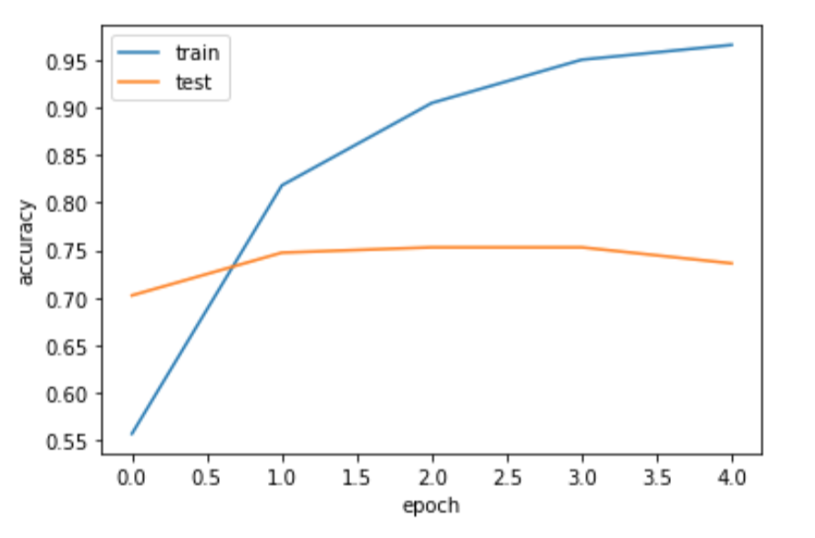
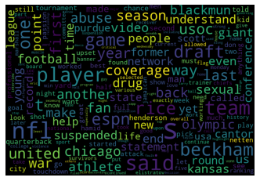

# Fake News Recognition & Classification Project

## Project Overview 
With the abundance of media outlets in the modern world it has become increasingly difficult to separate credible news from the unreliable. Because of this, we have decided to create an application that allows a users to input articles into a website and return the validity of the article contents and the category type of the article.

From this analysis, we hope to answer the following questions:
- What categories of articles are more likely to include false information?
- What words or phrases tend to show up the most in fake news as compared to the credible?

## Architecture
In order to accomplish our goal, we've used the following tools to develop the different aspects of our application:
- Data Cleaning & Preprocessing: Beautiful Soup, NLTK for Stop Word removal
- NLP Classification Models: Scikit-Learn & pre-trained Hugging Face model
- Visualizations: MatPlotLib & Plotly
- Website development: HTML, CSS, Bootstrap, Javascript & Flask
- Deployment: Heroku

## Project Milestones
1. Identify Data Sources to train models
    - Article Categories: https://www.kaggle.com/datasets/rmisra/news-category-dataset
    - Article Validity: https://www.kaggle.com/datasets/clmentbisaillon/fake-and-real-news-dataset

2. Scraping and Preprocessing of datasets: 

- Utilize BeautifulSoup and Splinter libraries to scrape the HuffPOst website and retrieve the content of the news article from the categorical dataset.
- Utilize Pandas and NLTK to clean the data from both datasets, prepare the body of the articles for wordcloud generating and preprocess for machine learning models (removing puctuation, stop words and non-word characters)

3. Training of Validity model: splitting the datasets into training and testing subsets and using those datasets to test which model types have the best accurary. After testing Naive Bayes, Logistical Regression, Decision Tree and Random Forest models, we selected the Decision Tree model due to it's highest rate of accuracy.

4. Training of Categorical model:

- Connect and configure TPU cluster for faster model training
- Convert the dataset into TF dataset format and split into train and test
- Tokenize the data using pre-trained Roberta tokenizer from HuggingFace
- Compile the model using pre-trained Roberta model from HuggingFace and fit on the training dataset
- Evaluate model performance on the validaton dataset
 
- Add ability for the user to pass in an article for prediction
- Display the final prediction and top 3 prediction categories.

5. Website development & database creation: create a site utilizing HTML, CSS and Bootstrap to allow for the input of an article, return of a prediction and display visualizations. The Flask app supports the back end interaction of the website, database and models.

6. Application Deployment: Heroku

## Ideas for Improvement
- Create a database to store all inputs to use for future training
- Since our True/False model was initially trained primarily on political articles, we would like to add more article categories to this training dataset
- Due to the amount of time required to scrape data, we only scraped a small subset for each category. Because of that, we would like to train more articles from each category

## Project Challenges
- At the beginning of the project, we found a training dataset that included both the category and whether the article was determined to be true or false. The issue that we ran into was that the data was not very clean and didn't lend itself to be very easy to work with for our purpose. This resulted in our team deciding to switch to the 2 datasets approach that accomplished our goal
- The categorical dataset that we decided to use only included a link to the article instead of the full content which required us to scrape the data from the site. With scraping, we ran into 2 different problems: 
    1) The site limiting the amount of articles one person could scrape
    2) Other team members gaining access to the S3 bucket to be able to scrape and store the articles
    
These issues resulted in a limited amount of articles that we were able to scrape and ultimately train the model with.

## Takeaways
We've learned as we've completed this project, but a few things have stuck out:
- Instead of immediately scraping data from a site, we will first look to see if an API is available
- Allow our data to help drive what our project intentions are. Sticking to strict project goals is difficult when you don't have the data to support it
- "Real world" data is messy and can take a lot of time to access, then clean to get into a usable format